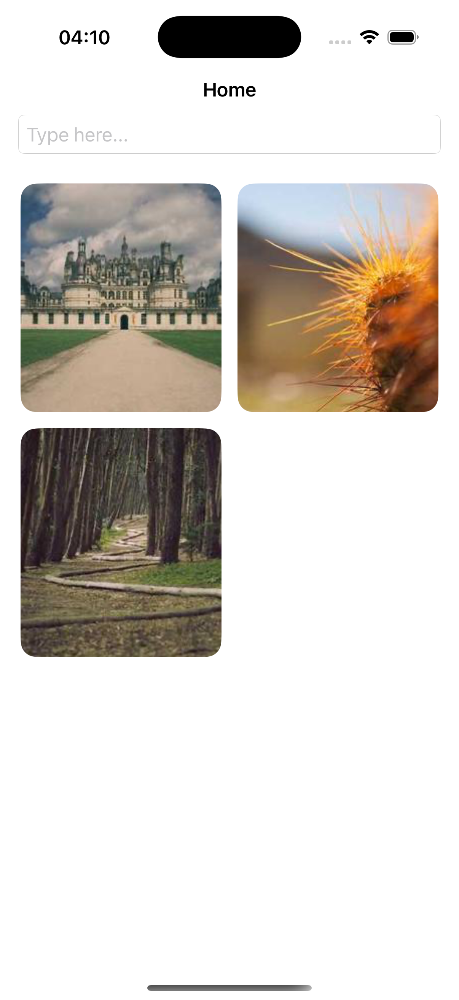
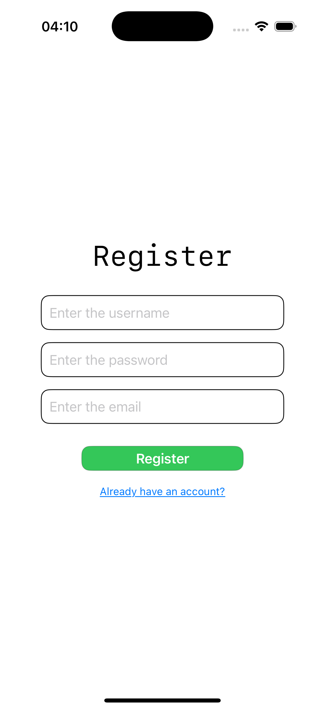

# 🖼️ Vearn

Vearn is a modern visual discovery app inspired by Pinterest — built to help users explore, save, and share creative ideas.  
With a clean design and smooth browsing experience, Vearn makes it easy to discover inspiration from art, design, photography, and beyond.

---

## 🚀 Features

- 🧩 Masonry-style image grid (Pinterest-like layout)
- 🔍 Search and filter images by categories
- ❤️ Save, like, and organize favorite posts
- 👤 User authentication and personal boards
- ⚡ Fast, modern UI with responsive design

---

## 🛠️ Tech Stack

| Area | Technologies |
|------|---------------|
| Frontend | SwiftUI (iOS) |
| Backend | Node.js / Express |
| Database | MongoDB |
| Design | Figma / SF Symbols |

---

## 📱 Screenshots

  
  
  

---

## 👤 Author

**kandratiche**
- [GitHub](https://github.com/kandratiche)
- [Telegram](https://t.me/kandratiche)
